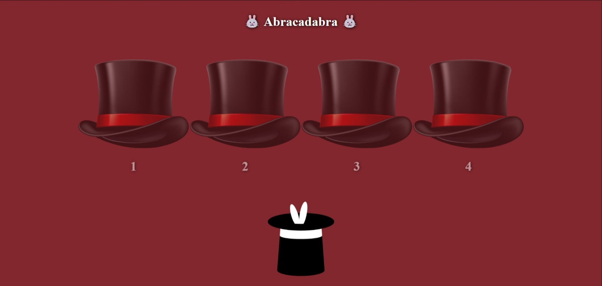

# Desafío Abracadabra

Este proyecto implementa un servidor utilizando Node.js y Express para crear un sitio web estático con temática de magia. Permite a los usuarios registrados participar en juegos de azar relacionados con los shows ofrecidos por un instituto recreativo.

## Tecnologías Utilizadas

- Node.js
- Express
- HTML
- CSS
- Javascript

## Funcionalidades

- **Obtención de Usuarios**: La ruta `/abracadabra/usuarios` devuelve un JSON con un arreglo de nombres alojado en el servidor.
- **Validación de Usuario**: El middleware verifica la existencia del usuario proporcionado en el arreglo de usuarios. Si el usuario es válido, se permite el acceso al juego; de lo contrario, se devuelve la imagen "who.jpeg".
- **Juego de Azar**: La ruta `/abracadabra/juego/:usuario` muestra el juego a usuarios válidos.
- **Visualización de Imágenes Aleatorias**: La ruta `/abracadabra/conejo/:n` muestra imágenes aleatorias de un conejo o Voldemort según el número ingresado.
- **Manejo de Rutas no Definidas**: La ruta genérica devuelve un mensaje indicando que la página no existe al consultar una ruta no definida en el servidor.

## Instalación y Ejecución

1. Clona el repositorio o descarga el código.
2. Instala las dependencias con `npm install`.
3. Ejecuta el servidor con `npm run dev` o `npm start`.
4. Accede al servidor desde tu navegador en `http://localhost:3000`.